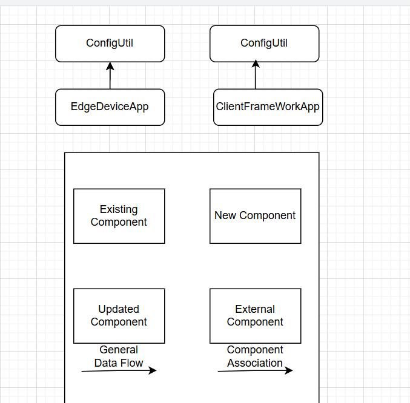

# Programming Digital Twins

## Lab Module 01 README.md

Be sure to implement all the requirements listed at [PDT-INF-01-001 - Lab Module 01](https://github.com/programming-digital-twins/pdt-exercise-tasks/issues/9).

### Description

INSTRUCTIONS: Describe, in your own words, the high-level functionality of this lab module by answering the questions listed below.

What does your implementation do? 
The implementation focuses on setting up a development environment for the edgedeviceapp , clientframework application and the digitaltwinapp

How does your implementation work?
Edgedevice application is cloned and setup within vscode along with all dependancies installed.  
Digitaltwin application is setup in Unity 6.0 environment all nessecary packages are installed 
ClientFrameWork application is setup along with DTDL parsers.

### Design Diagram(s)

INSTRUCTIONS: Include one or more design diagram(s) representing your solution.

### Specific Features

INSTRUCTIONS: List the specific features implemented (or integrated) as part of this lab module. Preface each with either 'EDA' (for the Edge Device App) or 'DTA' (for the Digital Twin App). Keep each feature as concise as possible - e.g., 'EDA: Connects to MQTT broker' or 'DTA: Consumes EDA telemetry via MQTT'.

- EDA - ConfigUtilTest (unititest)
- EDA - EdgeDeviceAppTest (integration test)
- CFW - ConfigUtilTest
- DTA - ThirdPersonCharacterControllerTest

EOF.

[def]: image.png