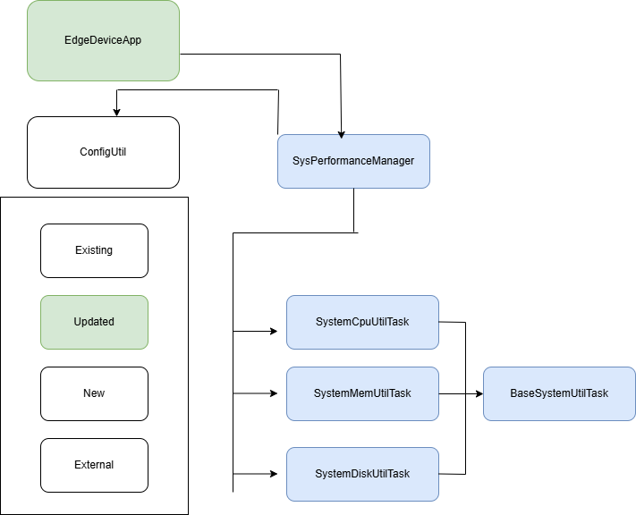

# Programming Digital Twins

## Lab Module 02 README.md

Be sure to implement all the requirements listed at [PDT-INF-02-001 - Lab Module 02](https://github.com/programming-digital-twins/pdt-exercise-tasks/issues/10).

### Description

INSTRUCTIONS: Describe, in your own words, the high-level functionality of this lab module by answering the questions listed below.

What does your implementation do? 
The implementation works on testing various simulation and integration elements of the codebase with the EdgeDeviceApp . Specefically the implementation focuses on initial data generation features and state management and polling schedule for each application.

How does your implementation work?
SenseHatEmulator is installed and the integration logic is tested 
Datatranslation and component integration capabilities of the EdgeDeviceApp are tested out.
Data simulation logic is tested within the EdgeDeviceApp
### Design Diagram(s)

INSTRUCTIONS: Include one or more design diagram(s) representing your solution.

### Specific Features

INSTRUCTIONS: List the specific features implemented (or integrated) as part of this lab module. Preface each with either 'EDA' (for the Edge Device App) or 'DTA' (for the Digital Twin App). Keep each feature as concise as possible - e.g., 'EDA: Connects to MQTT broker' or 'DTA: Consumes EDA telemetry via MQTT'.

-ActuatorDataTest
-SensorDataTest
-SystemPerformanceDataTest
-HumidifierActuatorSimTaskTest
-HvacActuatorSimTaskTest
-SensorAdapterManager
-ActuatorAdapterManagerTest
-SenseHatEmulatorQuickTest
-HumidityEmulatorTaskTest
-PressureEmulatorTaskTest
-TemperatureEmulatorTaskTest
-HumidifierEmulatorTaskTest
-HvacEmulatorTaskTest
-LedDisplayEmulatorTaskTest
-SensorEmulatorManagerTest
-ActuatorEmulatorManagerTest
- 

EOF.

[def]: labmod02.drawio.png