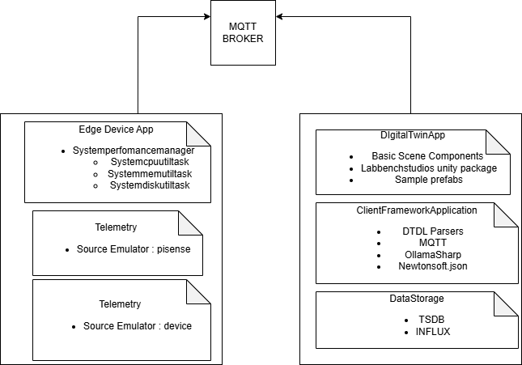

# Programming Digital Twins

## Lab Module 03 README.md

Be sure to implement all the requirements listed at [PDT-INF-03-001 - Lab Module 03](https://github.com/programming-digital-twins/pdt-exercise-tasks/issues/11).

### Description

INSTRUCTIONS: Describe, in your own words, the high-level functionality of this lab module by answering the questions listed below.

What does your implementation do? 
The implementation builds basic Digital Twin App functionality in unity 

How does your implementation work?
Scene Components are added to the DTA Package 
Sample Prefabs are added to the DTA package in unity 

### Design Diagram(s)

INSTRUCTIONS: Include one or more design diagram(s) representing your solution.

### Specific Features

INSTRUCTIONS: List the specific features implemented (or integrated) as part of this lab module. Preface each with either 'EDA' (for the Edge Device App) or 'DTA' (for the Digital Twin App). Keep each feature as concise as possible - e.g., 'EDA: Connects to MQTT broker' or 'DTA: Consumes EDA telemetry via MQTT'.

- Unity 3D logging messages 
- 
- 

EOF.
