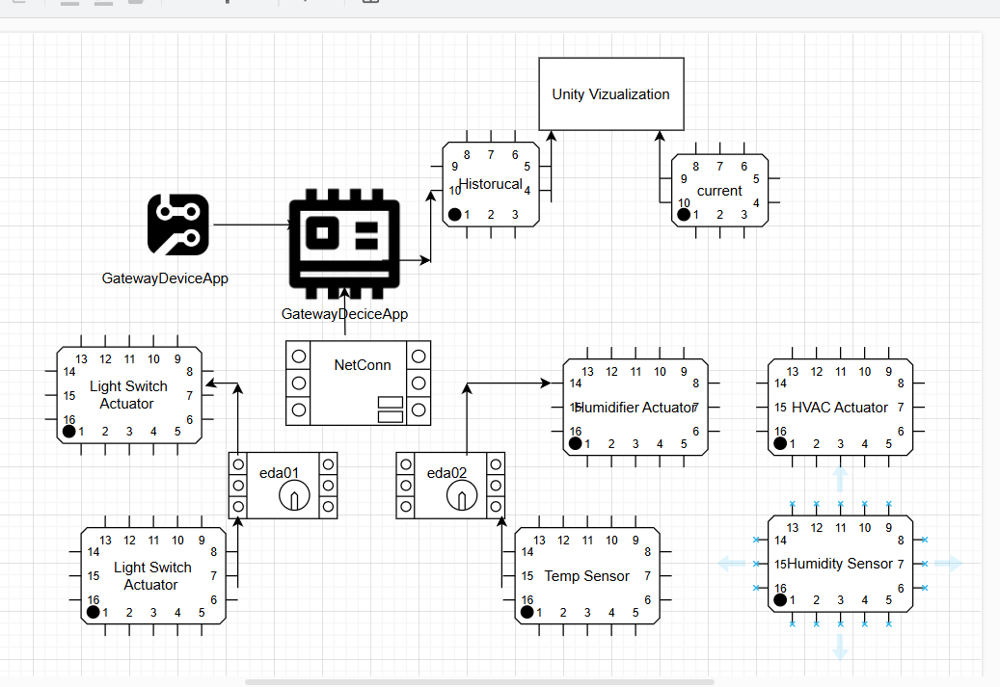

# Programming Digital Twins

## Lab Module 04 README.md

Be sure to implement all the requirements listed at [PDT-INF-04-001 - Lab Module 04](https://github.com/programming-digital-twins/pdt-exercise-tasks/issues/12).

### Description

INSTRUCTIONS: Describe, in your own words, the high-level functionality of this lab module by answering the questions listed below.

What does your implementation do? 
Add telemetry processing capabilities to the EDA and DTA.
Add an MQTT client to the EDA, and integrate with the CFW's MQTT client within the DTA.
As an additional exercise (optional for now), add a TSDB client to the EDA, and integrate with the CFW's TSDB client within the DTA.
Send a basic data payload from the EDA to the DTA via MQTT (optionally via TSDB).
How does your implementation work?
Testing of MQTT client connector component within the Edge Device App 
Integration of Digital Twin System Manager and CFW components within the Digital Twin App 
Test basic MQTT client integration between the EDA and DTA 

### Design Diagram(s)

INSTRUCTIONS: Include one or more design diagram(s) representing your solution.

### Specific Features

INSTRUCTIONS: List the specific features implemented (or integrated) as part of this lab module. Preface each with either 'EDA' (for the Edge Device App) or 'DTA' (for the Digital Twin App). Keep each feature as concise as possible - e.g., 'EDA: Connects to MQTT broker' or 'DTA: Consumes EDA telemetry via MQTT'.

-EDA - Mqttclientconnectortest
-DTA - IntegrationTests
-DTA - CharacterControlPanel Integration 

EOF.
